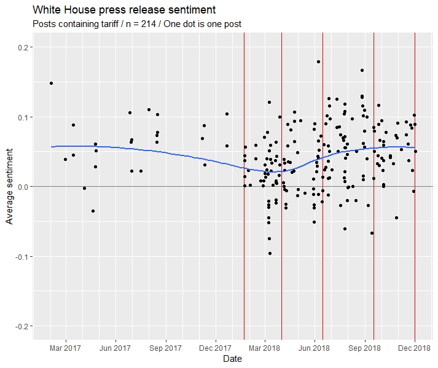
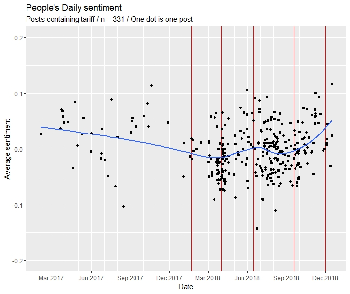

# Make Trade, Not War

This repo contains supporting resources for a big data project titled *Make Trade, Not War*, carried out by Gordon Xiang, Huahao Zhou, and Daniel Zhao. We undertook this project as the final project for Professor William King's Fall 2018 course at Yale University's Jackson Institute for Global Affairs, *Big Data and Global Policies* (GLBL 849).

The project centers on tracking government news sources over the source of the last two years (at time of writing) to analyze the texts' attitude towards the trade war. We scrape three news sources: press releases found on the White House.gov website, People's Daily, and China Daily, the former of which represents the official viewpoint of the United States government and the latter two of which serves as the official mouthpiece of the Chinese government. We then track how sentiment contained in these articles changes over time and extract the most common keywords used in each corpus.

The `scrapers` folder contains the Python code we used to scrape the text of all three sites, the `scrapedText` folder contains the raw unprocessed .csv files that we obtained from the scrapers, and the `analysis` folder contains the RMarkdown script we used to pre-process the text, analyze the data, and generate the output graphs.

Below is a summary of our key quantitative findings. Please contact iamdanzhao@gmail.com if you would like to read the full text, or have questions about the code. You may use the code for your own purposes, but all code is provided as-is.

## Project synopsis

In 2016, President Donald Trump vowed to go on an offensive against unfair Chinese economic practices. Today, Washington has levied tariffs on Chinese goods totaling to [$250 billion USD](https://www.nytimes.com/2018/09/17/us/politics/trump-china-tariffs-trade.html), and for its part, Beijing has done the same for $110 billion USD worth of American goods. With neither side backing down, could we somehow use official statements released by both governments to predict the future of the trade war?

To answer this question, we turned to data sources that represent official, state-endorsed positions by each country. On the Chinese side, we turned to articles posted on two Chinese state-sanctioned newspapers, China Daily and People’s Daily, two widely-read newspapers in China. Surprisingly, it was more difficult to find official positions for the United States side; we eventually turned to the archive of White House press releases and statements, which contains news briefings and press releases published since the inauguration of President Donald Trump.

#### Research questions

1. What keywords are used to describe the Trade War across official Chinese and US media outlets?
2. How do these keywords correlate with actual events and policy changes during the trade war?
3. How can text processing and NLP be used to predict future changes in policy during the trade war?

#### Data collection

We scraped the [White House news archive](https://www.whitehouse.gov/news/), which contains official statements, press releases, remarks, and transcripts of press briefings since Trump's inauguration in January 2017 up to early December 2018 (the time of scraping), for article titles, dates, and content. Since this dataset contains all content posted by his administration, we then performed a search for the word "tariff" to yield one dataset, and then for "trade war" to yield another dataset, to filter out any documents that weren't related to the trade war.

We alo scraped the [People's Daily](people.com.cn) and [China Daily](chinadaily.com.cn) websites by searching for the terms "tariff" and "trade war", and scraping all search results going back to January 2017 to match the date range of the White House release dataset. 

The analysis displays graphics for the "tariffs" datasets for each of White House, People's Daily, and China Daily, but results and patterns were similar for the "trade war" dataset.

#### Data processing

- Scraping White House and People’s Daily in Python using `requests` and `BeautifulSoup`
- Scraping China Daily in Python using `requests`, `BeautifulSoup`, and `Selenium`
- Cleaning in R using `tidytext` and `textstem`: tokenizing, lemmatizing, removing stopwords, attaching sentiment
- Analysis in R using `tidytext`, visualization using `ggplot2`, and topic models using `topicmodels`

The sentiment scale used was the "Bing" sentiment scorings provided in the R `tidytext` package, which rates words as "positive", "negative", or no score. Words assigned the label "positive" were coded as `+1`, "negative" as `-1`, and neutral as `0`. These scores were then averaged across all the words in a document to find a document's average sentiment. Other sentiment scales provided in R either provided labels to a smaller share of the words in our corpus or did not attach sentiments that could easily be translated into a numerical scale.

## Key findings

### Keyword analysis

The top 20 bigram keywords observed in each of the cleaned, lemmatized, and stopwords-removed corpuses were as follows (ordered from first-place to twentieth-place:

|White House |n| People's Daily |n|China Daily|n|
|--- |--- |--- |--- |--- |--- |
|national security|90|free trade|85|percent tariff|458|
|trade deal|88|percent tariff|84|free trade|457|
|long time|76|trade organization|84|trade partner|401|
|north korea|71|international trade|81|european union|378|
|american worker|68|chinese good|74|trade dispute|362|
|south korea|68|billion u.s|70|trade organization|362|
|american people|67|multilateral trade|63|impose tariff|350|
|tax cut|66|additional tariff|61|chinese good|338|
|intellectual property|62|intellectual property|59|intellectual property|315|
|european union|61|trade system|58|chinese import|314|
|trade practice|56|economic growth|57|international trade|302|
|unfair trade|54|global trade|54|billion worth|298|
|free trade|49|chinese import|52|global trade|289|
|great job|49|trade dispute|49|large economy|238|
|trade deficit|48|trade partner|49|trade tension|237|
|trade agreement|47|chinese market|48|long term|236|
|reciprocal trade|45|organization wto|48|2018 photo|233|
|play field|44|chinese product|47|global economy|230|
|executive order|42|global economy|47|economic growth|227|
|good job|41|trade representative|47|trade deficit|227|

The first observation that sticks out is that the words differ significantly between U.S. and Chinese sources: only two phrases, intellectual property and free trade, are shared by the White House and People's Daily datasets, and only four words are shared between the White House and China Daily datasets, while thirteen words are shared between the two Chinese datasets. The latter observation is reassuring, as it provides evidence that the People's Daily and China Daily datasets are sufficiently similar.

The top keywords in the Chinese datasets place a greater emphasis on the notion of free trade and the liberal international order, with words such as "trade organization" (referring to the WTO), "trade system", and "global economy". Furthermore, the use of words such as "trade partner", "trade organization", and "multilateral trade" suggest that these sources prefer to emphasize the importance of cooperation and multilateralism in solving the trade dispute. In contrast, the White House dataset seems to place greater importance on domestic issues: subjects such as "national security", creating a level "playing field", and Trump's "tax cuts" are mentioned (note that they appear slightly differently in the above results because these results are the lemmatized forms of the words).

### Sentiment change over time

In the below graphs, the five red lines correspond to the following events:

- **First red line: January 22, 2018**, when the Trump administration announced the first wave of tariffs
- **Second red line: April 1, 2018**, when China launches its retaliatory tariffs
- **Third red line: June 25, 2018**, when the Trump administration announced the second wave of tariffs
- **Fourth red line: September 17, 2018**, when the Trump administration announces the third wave
- **Fifth red line: December 1, 2018**, when both sides agreed to a trade truce

The blue lines are smoothing curves applied to the scatterplot.

We can see that at a majority of the major tariff events we've identified, there is a notable behavior in the smoothing curve, either a trough, peak, or inflection point. We also notice that there are clusters of posts near these events. This indicates, as expected, that both parties are putting out content around the time of these tariff events, and Chinese posts generally lag slightly behind White House press release posts, presumably Chinese coverage of tariffs are mostly reactionary to US tariff decisions. This is most evident in the March/April round of tariffs: the second red line in all three graphs above mark April 1, 2018, and we see that the clustering of posts on the White House website are mostly clustered before the line, while the clustering of posts on the Chinese websites are heavily clustered around the line itself.

One pattern to note is the behavior of sentiment in relation to negotiations attempts. In early May, we see average sentiment rise truce talks and negotiations. During this period, there were two instances where the United States and China engaged in talks to attempt to reach a deal: the first occurred in early May and failed, while the second occurred in early December and resulted in a successful 90-day trade truce. In both instances, we see average sentiment rise approaching these events (look to the period immediately following the second red line and the period immediately preceding the fifth red line). In the case of the failed truce in May, we see sentiment reach a peak in early May, then return to a downward trajectory; we can hypothesize that this was a result of the failure to reach an agreement. In December, we do not yet have full data for sentiment changes following the agreement reached on December 1 (since our data ends on December 5); while we would expect sentiment to rise because of the successful attempt at reaching an agreement, it will be interesting to see how the arrest of Huawei CFO Meng Wanzhou interacts with the trend.

### Experiments with topic models

We used our comparison of the most common bigrams to try to draw inferences about what White House press releases and China Daily/People’s Daily articles talked about, but can we try to categorize posts into distinct “subject areas”? For this question, we turned to latent dirichlet allocation (LDA) topic models, an algorithm that assumes different words belong to different “topics” (essentially clusters of words) and we can use the topic labels of the words in each post to determine the topic to which an entire post corresponds.

We made topic models with k = 5 topics for the White House and People’s Daily corpuses, which gave these results:

#### White House data: LDA model with k = 5 topics

| Topic |	Most common words |
| ----- | ----------------- |
| 1 |	china good state trade work agreement america american nation world |
| 2 |	deal good great happen make people talk thing time lot |
| 3	| section state tariff aluminum security steel import national article proclamation |
| 4 | good make question state talk house continue ms sander sarah |
| 5 | good great make people work year applause job lot tax |

#### People's Daily data: LDA model with k = 5 topics

| Topic |	Most common words |
| ----- | ----------------- |
| 1	| chinese good import product tariff trade billion china state u.s |
| 2	| economic trade china international percent economy world â war global |
| 3	| economic good investment trade year china open world global development |
| 4	| chinese import product tariff trade year china market percent u.s |
| 5	| import tariff trade china state u.s deficit steel eu |

While the topic models created topics that are separate (although arguably so), these results don't necessarily shed light onto the content of the White House or People's Daily articles more than what our prior keyword analysis already told us. For example, in the case of the United States, we already knew that "jobs" and "making people work" was a key theme of Trump's statements, and in the case of People's Daily, we already knew that China discussed its role on the international stage extensively.

Because the topic models added an additional layer of complexity without significant return, we decided to eschew these models in the final analysis, although these results are included here to accompany the provided code.

## Conclusion and next steps

As we discussed above, we’re eager to find out what happens to sentiment following the recent trade truce. While we would expect sentiment to increase because to the successful truce, the unforeseen arrest of Huawei’s Chief Financial Officer could present interesting results: if sentiment continues to increase, perhaps that is a sign that the Huawei arrest was not nearly as significant of an event as many narratives initially portrayed it to be.

Our model was fairly basic: we used just one source on the American side, and just two sources on the Chinese side. An extension of our research would add additional inputs for tokenization, sentiment analysis, and keyword analysis, such as President Trump’s Twitter archive. We could also look at adding numeric data series as inputs to the model, such as stock index performance or search engine interest (although such variables would need to be adjusted significantly to account for effects caused by other political or economic events occurring in both US-China relations, or for cross-correlations in time series data). Adding additional variables, with appropriate attention towards details, would allow our model to become more predictive in nature: as it stands, having two data series on average US sentiment and average China sentiment allows us retroactively correlate events but provides little room to predict future policy change, particularly so with such a small sample size and limited time range. To this end, our work thus far has not yet broached the full potential of our third and final research question, the ability to predict future policy directions.

Regardless, our method and findings has shown that it is feasible to use text processing methods on official policy statements from governments to match changes in sentiments with policy shifts and to use keywords to infer how governments communicate issues (which correspond to the first and second of our initial research questions). We can reasonably see this methodology being applied to other issues that also involve two nations sparring over one issue for an extended period of time, which would allow sufficient data to be collected. However, we see the main difficulty lying in the selection of data sources: one reason it is so comparatively simply to extract Chinese policy positions is because its authoritarian social-political framework means that media outlets directly serve as mouthpieces of the government. This is true of other authoritarian regimes in the developing world, but may not necessarily be true in more developed, Western democracies. We invite others to apply our approach towards other diplomatic and geopolitical issues.

